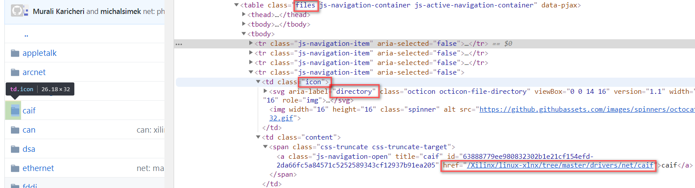

# github get

You will find this table when opened a github page.



This script using pycurl and BeautifulSoup4.

- pycurl: download page from github
- bs4: analysis html, and extract table
- lxml: bs4 backend

How to use

```sh
github_get.py https://github.com/Xilinx/linux-xlnx/tree/master/drivers/net/can
```

you will find `cache` and `download` directories.

```
$ python3 githubget.py https://github.com/Xilinx/linux-xlnx/tree/master/drivers/net/can
Info: analysis https://github.com/Xilinx/linux-xlnx/tree/master/drivers/net/can
> URL: https://github.com/Xilinx/linux-xlnx/tree/master/drivers/net/can
> URL: https://github.com/Xilinx/linux-xlnx/tree/master/drivers/net/can/c_can
> URL: https://github.com/Xilinx/linux-xlnx/tree/master/drivers/net/can/cc770
> URL: https://github.com/Xilinx/linux-xlnx/tree/master/drivers/net/can/ifi_canfd
> URL: https://github.com/Xilinx/linux-xlnx/tree/master/drivers/net/can/m_can
> URL: https://github.com/Xilinx/linux-xlnx/tree/master/drivers/net/can/mscan
> URL: https://github.com/Xilinx/linux-xlnx/tree/master/drivers/net/can/peak_canfd
> URL: https://github.com/Xilinx/linux-xlnx/tree/master/drivers/net/can/rcar
> URL: https://github.com/Xilinx/linux-xlnx/tree/master/drivers/net/can/sja1000
> URL: https://github.com/Xilinx/linux-xlnx/tree/master/drivers/net/can/softing
> URL: https://github.com/Xilinx/linux-xlnx/tree/master/drivers/net/can/spi
> URL: https://github.com/Xilinx/linux-xlnx/tree/master/drivers/net/can/usb
> URL: https://github.com/Xilinx/linux-xlnx/tree/master/drivers/net/can/usb/kvaser_usb
> URL: https://github.com/Xilinx/linux-xlnx/tree/master/drivers/net/can/usb/peak_usb
Info: found 92 files
> URL: https://github.com/Xilinx/linux-xlnx/raw/master/drivers/net/can/Kconfig
  write: download\Kconfig
> URL: https://github.com/Xilinx/linux-xlnx/raw/master/drivers/net/can/Makefile
  write: download\Makefile
> URL: https://github.com/Xilinx/linux-xlnx/raw/master/drivers/net/can/at91_can.c
  write: download\at91_can.c
> URL: https://github.com/Xilinx/linux-xlnx/raw/master/drivers/net/can/dev.c
  write: download\dev.c
> URL: https://github.com/Xilinx/linux-xlnx/raw/master/drivers/net/can/flexcan.c
  write: download\flexcan.c
> URL: https://github.com/Xilinx/linux-xlnx/raw/master/drivers/net/can/grcan.c
  write: download\grcan.c
> URL: https://github.com/Xilinx/linux-xlnx/raw/master/drivers/net/can/janz-ican3.c
  write: download\janz-ican3.c
> URL: https://github.com/Xilinx/linux-xlnx/raw/master/drivers/net/can/led.c
  write: download\led.c
> URL: https://github.com/Xilinx/linux-xlnx/raw/master/drivers/net/can/pch_can.c
  write: download\pch_can.c
> URL: https://github.com/Xilinx/linux-xlnx/raw/master/drivers/net/can/rx-offload.c
  write: download\rx-offload.c
> URL: https://github.com/Xilinx/linux-xlnx/raw/master/drivers/net/can/slcan.c
  write: download\slcan.c
> URL: https://github.com/Xilinx/linux-xlnx/raw/master/drivers/net/can/sun4i_can.c
  write: download\sun4i_can.c
> URL: https://github.com/Xilinx/linux-xlnx/raw/master/drivers/net/can/ti_hecc.c
  write: download\ti_hecc.c
> URL: https://github.com/Xilinx/linux-xlnx/raw/master/drivers/net/can/vcan.c
  write: download\vcan.c
> URL: https://github.com/Xilinx/linux-xlnx/raw/master/drivers/net/can/vxcan.c
  write: download\vxcan.c
> URL: https://github.com/Xilinx/linux-xlnx/raw/master/drivers/net/can/xilinx_can.c
  write: download\xilinx_can.c
> URL: https://github.com/Xilinx/linux-xlnx/raw/master/drivers/net/can/c_can/Kconfig
  write: download\c_can\Kconfig
> URL: https://github.com/Xilinx/linux-xlnx/raw/master/drivers/net/can/c_can/Makefile
  write: download\c_can\Makefile
> URL: https://github.com/Xilinx/linux-xlnx/raw/master/drivers/net/can/c_can/c_can.c
  write: download\c_can\c_can.c
> URL: https://github.com/Xilinx/linux-xlnx/raw/master/drivers/net/can/c_can/c_can.h
  write: download\c_can\c_can.h
> URL: https://github.com/Xilinx/linux-xlnx/raw/master/drivers/net/can/c_can/c_can_pci.c
  write: download\c_can\c_can_pci.c
> URL: https://github.com/Xilinx/linux-xlnx/raw/master/drivers/net/can/c_can/c_can_platform.c
  write: download\c_can\c_can_platform.c
> URL: https://github.com/Xilinx/linux-xlnx/raw/master/drivers/net/can/cc770/Kconfig
  write: download\cc770\Kconfig
> URL: https://github.com/Xilinx/linux-xlnx/raw/master/drivers/net/can/cc770/Makefile
  write: download\cc770\Makefile
> URL: https://github.com/Xilinx/linux-xlnx/raw/master/drivers/net/can/cc770/cc770.c
  write: download\cc770\cc770.c
> URL: https://github.com/Xilinx/linux-xlnx/raw/master/drivers/net/can/cc770/cc770.h
  write: download\cc770\cc770.h
> URL: https://github.com/Xilinx/linux-xlnx/raw/master/drivers/net/can/cc770/cc770_isa.c
  write: download\cc770\cc770_isa.c
> URL: https://github.com/Xilinx/linux-xlnx/raw/master/drivers/net/can/cc770/cc770_platform.c
  write: download\cc770\cc770_platform.c
> URL: https://github.com/Xilinx/linux-xlnx/raw/master/drivers/net/can/ifi_canfd/Kconfig
  write: download\ifi_canfd\Kconfig
> URL: https://github.com/Xilinx/linux-xlnx/raw/master/drivers/net/can/ifi_canfd/Makefile
  write: download\ifi_canfd\Makefile
> URL: https://github.com/Xilinx/linux-xlnx/raw/master/drivers/net/can/ifi_canfd/ifi_canfd.c
  write: download\ifi_canfd\ifi_canfd.c
> URL: https://github.com/Xilinx/linux-xlnx/raw/master/drivers/net/can/m_can/Kconfig
  write: download\m_can\Kconfig
> URL: https://github.com/Xilinx/linux-xlnx/raw/master/drivers/net/can/m_can/Makefile
  write: download\m_can\Makefile
> URL: https://github.com/Xilinx/linux-xlnx/raw/master/drivers/net/can/m_can/m_can.c
  write: download\m_can\m_can.c
> URL: https://github.com/Xilinx/linux-xlnx/raw/master/drivers/net/can/mscan/Kconfig
  write: download\mscan\Kconfig
> URL: https://github.com/Xilinx/linux-xlnx/raw/master/drivers/net/can/mscan/Makefile
  write: download\mscan\Makefile
> URL: https://github.com/Xilinx/linux-xlnx/raw/master/drivers/net/can/mscan/mpc5xxx_can.c
  write: download\mscan\mpc5xxx_can.c
> URL: https://github.com/Xilinx/linux-xlnx/raw/master/drivers/net/can/mscan/mscan.c
  write: download\mscan\mscan.c
> URL: https://github.com/Xilinx/linux-xlnx/raw/master/drivers/net/can/mscan/mscan.h
  write: download\mscan\mscan.h
> URL: https://github.com/Xilinx/linux-xlnx/raw/master/drivers/net/can/peak_canfd/Kconfig
  write: download\peak_canfd\Kconfig
> URL: https://github.com/Xilinx/linux-xlnx/raw/master/drivers/net/can/peak_canfd/Makefile
  write: download\peak_canfd\Makefile
> URL: https://github.com/Xilinx/linux-xlnx/raw/master/drivers/net/can/peak_canfd/peak_canfd.c
  write: download\peak_canfd\peak_canfd.c
> URL: https://github.com/Xilinx/linux-xlnx/raw/master/drivers/net/can/peak_canfd/peak_canfd_user.h
  write: download\peak_canfd\peak_canfd_user.h
> URL: https://github.com/Xilinx/linux-xlnx/raw/master/drivers/net/can/peak_canfd/peak_pciefd_main.c
  write: download\peak_canfd\peak_pciefd_main.c
> URL: https://github.com/Xilinx/linux-xlnx/raw/master/drivers/net/can/rcar/Kconfig
  write: download\rcar\Kconfig
> URL: https://github.com/Xilinx/linux-xlnx/raw/master/drivers/net/can/rcar/Makefile
  write: download\rcar\Makefile
> URL: https://github.com/Xilinx/linux-xlnx/raw/master/drivers/net/can/rcar/rcar_can.c
  write: download\rcar\rcar_can.c
> URL: https://github.com/Xilinx/linux-xlnx/raw/master/drivers/net/can/rcar/rcar_canfd.c
  write: download\rcar\rcar_canfd.c
> URL: https://github.com/Xilinx/linux-xlnx/raw/master/drivers/net/can/sja1000/Kconfig
  write: download\sja1000\Kconfig
> URL: https://github.com/Xilinx/linux-xlnx/raw/master/drivers/net/can/sja1000/Makefile
  write: download\sja1000\Makefile
> URL: https://github.com/Xilinx/linux-xlnx/raw/master/drivers/net/can/sja1000/ems_pci.c
  write: download\sja1000\ems_pci.c
> URL: https://github.com/Xilinx/linux-xlnx/raw/master/drivers/net/can/sja1000/ems_pcmcia.c
  write: download\sja1000\ems_pcmcia.c
> URL: https://github.com/Xilinx/linux-xlnx/raw/master/drivers/net/can/sja1000/kvaser_pci.c
  write: download\sja1000\kvaser_pci.c
> URL: https://github.com/Xilinx/linux-xlnx/raw/master/drivers/net/can/sja1000/peak_pci.c
  write: download\sja1000\peak_pci.c
> URL: https://github.com/Xilinx/linux-xlnx/raw/master/drivers/net/can/sja1000/peak_pcmcia.c
  write: download\sja1000\peak_pcmcia.c
> URL: https://github.com/Xilinx/linux-xlnx/raw/master/drivers/net/can/sja1000/plx_pci.c
  write: download\sja1000\plx_pci.c
> URL: https://github.com/Xilinx/linux-xlnx/raw/master/drivers/net/can/sja1000/sja1000.c
  write: download\sja1000\sja1000.c
> URL: https://github.com/Xilinx/linux-xlnx/raw/master/drivers/net/can/sja1000/sja1000.h
  write: download\sja1000\sja1000.h
> URL: https://github.com/Xilinx/linux-xlnx/raw/master/drivers/net/can/sja1000/sja1000_isa.c
  write: download\sja1000\sja1000_isa.c
> URL: https://github.com/Xilinx/linux-xlnx/raw/master/drivers/net/can/sja1000/sja1000_platform.c
  write: download\sja1000\sja1000_platform.c
> URL: https://github.com/Xilinx/linux-xlnx/raw/master/drivers/net/can/sja1000/tscan1.c
  write: download\sja1000\tscan1.c
> URL: https://github.com/Xilinx/linux-xlnx/raw/master/drivers/net/can/softing/Kconfig
  write: download\softing\Kconfig
> URL: https://github.com/Xilinx/linux-xlnx/raw/master/drivers/net/can/softing/Makefile
  write: download\softing\Makefile
> URL: https://github.com/Xilinx/linux-xlnx/raw/master/drivers/net/can/softing/softing.h
  write: download\softing\softing.h
> URL: https://github.com/Xilinx/linux-xlnx/raw/master/drivers/net/can/softing/softing_cs.c
  write: download\softing\softing_cs.c
> URL: https://github.com/Xilinx/linux-xlnx/raw/master/drivers/net/can/softing/softing_fw.c
  write: download\softing\softing_fw.c
> URL: https://github.com/Xilinx/linux-xlnx/raw/master/drivers/net/can/softing/softing_main.c
  write: download\softing\softing_main.c
> URL: https://github.com/Xilinx/linux-xlnx/raw/master/drivers/net/can/softing/softing_platform.h
  write: download\softing\softing_platform.h
> URL: https://github.com/Xilinx/linux-xlnx/raw/master/drivers/net/can/spi/Kconfig
  write: download\spi\Kconfig
> URL: https://github.com/Xilinx/linux-xlnx/raw/master/drivers/net/can/spi/Makefile
  write: download\spi\Makefile
> URL: https://github.com/Xilinx/linux-xlnx/raw/master/drivers/net/can/spi/hi311x.c
  write: download\spi\hi311x.c
> URL: https://github.com/Xilinx/linux-xlnx/raw/master/drivers/net/can/spi/mcp251x.c
  write: download\spi\mcp251x.c
> URL: https://github.com/Xilinx/linux-xlnx/raw/master/drivers/net/can/usb/Kconfig
  write: download\usb\Kconfig
> URL: https://github.com/Xilinx/linux-xlnx/raw/master/drivers/net/can/usb/Makefile
  write: download\usb\Makefile
> URL: https://github.com/Xilinx/linux-xlnx/raw/master/drivers/net/can/usb/ems_usb.c
  write: download\usb\ems_usb.c
> URL: https://github.com/Xilinx/linux-xlnx/raw/master/drivers/net/can/usb/esd_usb2.c
  write: download\usb\esd_usb2.c
> URL: https://github.com/Xilinx/linux-xlnx/raw/master/drivers/net/can/usb/gs_usb.c
  write: download\usb\gs_usb.c
> URL: https://github.com/Xilinx/linux-xlnx/raw/master/drivers/net/can/usb/mcba_usb.c
  write: download\usb\mcba_usb.c
> URL: https://github.com/Xilinx/linux-xlnx/raw/master/drivers/net/can/usb/ucan.c
  write: download\usb\ucan.c
> URL: https://github.com/Xilinx/linux-xlnx/raw/master/drivers/net/can/usb/usb_8dev.c
  write: download\usb\usb_8dev.c
> URL: https://github.com/Xilinx/linux-xlnx/raw/master/drivers/net/can/usb/kvaser_usb/Makefile
  write: download\usb\kvaser_usb\Makefile
> URL: https://github.com/Xilinx/linux-xlnx/raw/master/drivers/net/can/usb/kvaser_usb/kvaser_usb.h
  write: download\usb\kvaser_usb\kvaser_usb.h
> URL: https://github.com/Xilinx/linux-xlnx/raw/master/drivers/net/can/usb/kvaser_usb/kvaser_usb_core.c
  write: download\usb\kvaser_usb\kvaser_usb_core.c
> URL: https://github.com/Xilinx/linux-xlnx/raw/master/drivers/net/can/usb/kvaser_usb/kvaser_usb_hydra.c
  write: download\usb\kvaser_usb\kvaser_usb_hydra.c
> URL: https://github.com/Xilinx/linux-xlnx/raw/master/drivers/net/can/usb/kvaser_usb/kvaser_usb_leaf.c
  write: download\usb\kvaser_usb\kvaser_usb_leaf.c
> URL: https://github.com/Xilinx/linux-xlnx/raw/master/drivers/net/can/usb/peak_usb/Makefile
  write: download\usb\peak_usb\Makefile
> URL: https://github.com/Xilinx/linux-xlnx/raw/master/drivers/net/can/usb/peak_usb/pcan_usb.c
  write: download\usb\peak_usb\pcan_usb.c
> URL: https://github.com/Xilinx/linux-xlnx/raw/master/drivers/net/can/usb/peak_usb/pcan_usb_core.c
  write: download\usb\peak_usb\pcan_usb_core.c
> URL: https://github.com/Xilinx/linux-xlnx/raw/master/drivers/net/can/usb/peak_usb/pcan_usb_core.h
  write: download\usb\peak_usb\pcan_usb_core.h
> URL: https://github.com/Xilinx/linux-xlnx/raw/master/drivers/net/can/usb/peak_usb/pcan_usb_fd.c
  write: download\usb\peak_usb\pcan_usb_fd.c
> URL: https://github.com/Xilinx/linux-xlnx/raw/master/drivers/net/can/usb/peak_usb/pcan_usb_pro.c
  write: download\usb\peak_usb\pcan_usb_pro.c
> URL: https://github.com/Xilinx/linux-xlnx/raw/master/drivers/net/can/usb/peak_usb/pcan_usb_pro.h
  write: download\usb\peak_usb\pcan_usb_pro.h
Info: wrote 1.352 Mb
Info: wrote "download/files.json"
```


